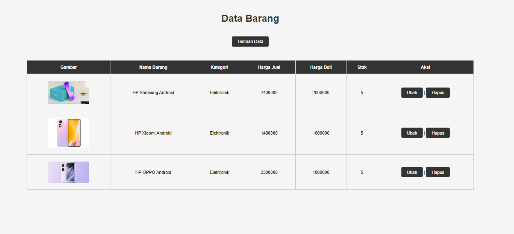

# Lab2WEB
Exercise Lab 2 WEB
<h1 align="center">Hi 👋, I'm <a href="https://100rabhcsmc.github.io/Me.io/" target="blank">
Muhammad Azizul Dzikri</a> indonesia</h1>
<h3 align="center">I am a student at Pelita Bangsa University </h3>

- 📫 How to reach me **azizuldzikri05@gmail.com**

 
<h3 align="center" > Connect with me 🤝 </h3>

---

Credit: [dezeeonpub](https://github.com/dezeeonpub)

#<?php
include_once("koneksi.php");
// query untuk menampilkan data
$sql = 'SELECT * FROM data_barang';
$result = mysqli_query($conn, $sql);
?>
<!DOCTYPE html>
<html lang="en">
<head>
    <meta charset="UTF-8">
    <link href="style.css" rel="stylesheet" type="text/css" />
    <title>Data Barang</title>
</head>
<body>
    

        <h1>Data Barang</h1>
        

            <table>
            <a href="tambah.php">Tambah Data</a>
                <tr>
                    <th>Gambar</th>
                    <th>Nama Barang</th>
                    <th>Kategori</th>
                    <th>Harga Jual</th>
                    <th>Harga Beli</th>
                    <th>Stok</th>
                    <th>Aksi</th>
                </tr>
                <?php if ($result) : ?>
                    <?php while ($row = mysqli_fetch_array($result)) : ?>
                        <tr>
                            <td>" alt="<?= $row['nama']; ?>"></td>
                            <td><?= $row['nama']; ?></td>
                            <td><?= $row['kategori']; ?></td>
                            <td><?= $row['harga_jual']; ?></td>
                            <td><?= $row['harga_beli']; ?></td>
                            <td><?= $row['stok']; ?></td>
                            <td>
                                <a href="ubah.php?id=<?= $row['id_barang']; ?>">Ubah</a> |
                                <a href="hapus.php?id=<?= $row['id_barang']; ?>" onclick="return confirm('Anda yakin akan menghapus data ini?')">Hapus</a>
                            </td>
                        </tr>
                    <?php endwhile;
                else : ?>
                    <tr>
                        <td colspan="7">Belum ada data</td>
                    </tr>
                <?php endif; ?>
            </table>
        

    

</body>
#</html>

